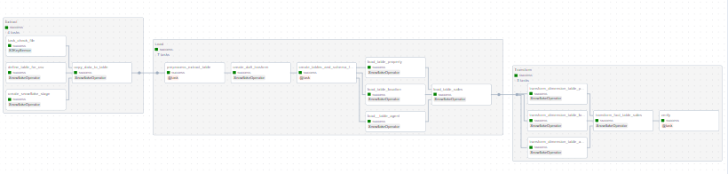

Overview
========

•	Orchestrated a data pipeline using Apache Airflow to ingest data from Daft.ie.
•	Implemented an ELT process deployed on the Airflow web server, where the ingested data was stored on an AWS S3 bucket and transformed before being loaded into a Snowflake database, serving as the data lake.
•	Created a star schema in data transformation phase by normalising the input data, which was subsequently utilized for data visualization and exploratory data analysis (EDA) in Tableau.
•	Automated the process by utilizing the Airflow Scheduler to monitor the AWS bucket for changes and containerized the project using Docker for easy deployment.

=========
Pipeline Diagram

![Airflow][image-1.png]

This project was developed using Astro sdk to start install astro sdk and run command astro dev start for airflow to be available on localhost